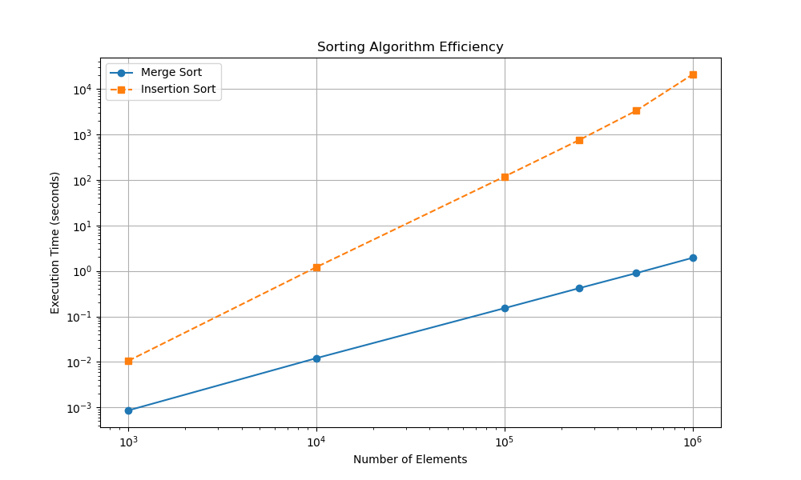

**Dylan Phoutthavong**

**February 18th, 2025**

**CSCI 3412**

# Extra Credit: Sorting Algorithm Execution Time Analysis

## Introduction
This assignment measures and visualizes the execution time of **Insertion Sort** and **Merge Sort** using six datasets:
`rand1000.txt`, `rand10000.txt`, `rand100000.txt`, `rand250000.txt`, `rand500000.txt`, and `rand1000000.txt`.

The results are plotted to analyze the scalability and **performance differences** of the two algorithms.

## Execution Results
### Time Complexity Comparison
| Dataset Size | Intertion Sort Time (s) | Merge Sort Time (s) |
|:---:         |:---:                    |:---:                |
|    1,000     |        0.010569         |       0.000860      |
|    10,000    |        1.212569         |       0.012101      |
|    100,000   |        118.4697519      |       0.151744      |
|    250,000   |        755.202096       |       0.418384      |
|    500,000   |  3,300.05348 (~55 min)  |       0.890694      |
|    1,000,000 | 20,784.469284 (~5.8 hrs)|       1.941502      |

- **Insertion Sort**: Grows **quadratically** (O($n^2$)), leading to an **exponential increase in execution time**.
- **Merge Sort**: Grows **logarithmically** (O(n log n)), allowing it to handle large datasets efficiently.

## Observations & Analysis

### Performance Differfences

- **Insertion Sort performs well for small inputs (≤10,000 elements)** but becomes impractical beyond **100,000 elements**.
- **Merge Sort remains efficient across all dataset sizes**, completing even **1,000,000 elements in ~2 seconds**.
- The gap **widens exponentially** as input size increases, demonstrating the importance of algorithm selection.

### Theoretical Time Complexity vs. Practical Performance

- **Insertion Sort’s O($n^2$) complexity** is clearly visible in execution times **increasing quadratically**.
- **Merge Sort’s O(n log n) complexity** is confirmed by its relatively **stable** execution time growth.

## Visual Representation

## Conclusion & Key Learnings

### Importance of Algorithm Selection
- Choosing the right algorithm **dramatically impacts performance**.
- **Merge Sort is superior** for large datasets due to its **O(n log n) efficiency**.
- **Insertion Sort is only practical** for very small datasets.

### Understanding Big-O Notation
- **Theoretical time complexity aligns with real execution times**.
- **O($n^2$) algorithms should be avoided** for large-scale sorting.
- **O(n log n) sorting algorithms like Merge Sort** ensure efficient performance.

## Final Thoughts
This experiment highlights the **practical impact of Big-O notation** and why **efficient sorting algorithms** like Merge Sort are used in real-world applications.