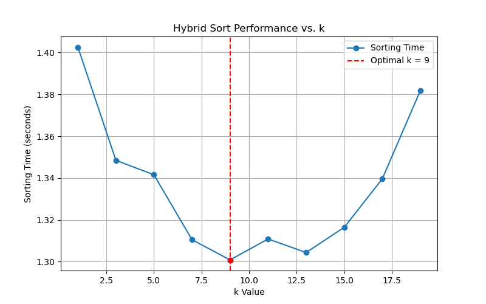
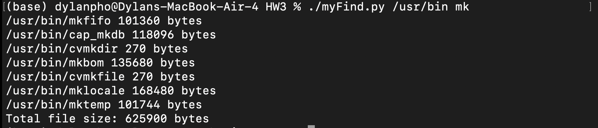

**Dylan Phoutthavong**

**March 10th, 2025**

**CSCI 3412**

# HW3 Outputs & Answers

### Q1 - 1) Max-Heapify [ 5 points ]

<mark>Test output #1:<mark>

```
Processing 1000000 numbers from /Users/dylanpho/Library/CloudStorage/OneDrive-TheUniversityofColoradoDenver/CU Denver/2024-2025/Spring 2025/CSCI 3412-Algorithms/Homeworks/HW3/rand1000000.txt...

Recursive max_heapify Execution Time: 0.18034 seconds
Iterative max_heapify Execution Time: 0.15414 seconds

✅ Iterative max_heapify is 14.53% faster than Recursive max_heapify.
```

<mark>Test output #2:<mark>

```
Processing 1000000 numbers from /Users/dylanpho/Library/CloudStorage/OneDrive-TheUniversityofColoradoDenver/CU Denver/2024-2025/Spring 2025/CSCI 3412-Algorithms/Homeworks/HW3/rand1000000.txt...

Recursive max_heapify Execution Time: 0.17905 seconds
Iterative max_heapify Execution Time: 0.15198 seconds

✅ Iterative max_heapify is 15.12% faster than Recursive max_heapify.
```

### Q1 - 2) Plateau-Valley Array [ 5 points ]

### Algorithm for Constructing a Plateau-Valley Array in O(n)
Given an **unsorted array** of `n` numbers, we need to transform it into a **plateau-valley array** following the conditions:

**Nums[0] ≤ Nums[1] ≥ Nums[2] ≤ Nums[3] ≥ Nums[4]** ... (Alternating pattern of peaks and valleys)
The solution must run in **O(n) time complexity**.

### Step-by-Step Algorithm (O(n) Approach)
1. **Iterate through the array** from index `1` to `n-1` (since Nums[0] remains unchanged).
2. **Check alternating conditions**:
   - If at an **even index** (`i`), ensure **`Nums[i-1] ≤ Nums[i]`** (plateau condition).
   - If at an **odd index** (`i`), ensure **`Nums[i-1] ≥ Nums[i]`** (valley condition).
3. **Swap values when needed**:
   - If a violation is found (i.e., `Nums[i]` does not follow the expected pattern), swap `Nums[i]` with `Nums[i-1]`.
4. **Continue until the end of the array**, ensuring the alternating sequence is maintained.

## Q 2) Time Efficiency Exercise Questions [Total 10 points] 

### Q2 - 1) Use the substitution method to show the asymptotic time expression (Big-Oh) of the following recurrence (7 points)

$T(n) = 9T(n/3) + n$

1. Exapand recurrance:
   - $T(n) = 9T(n/3) + n$
   - $T(n/3) = 9T(n/9) + n/3$
   - $T(n) = 9(9T(n/9) + n/3) + n = 9^2 T (n/9) +9n/3 + n$ 
  
- $T(n) = 9^nT(n/3^k) + n \sum_{i=0}^{k-1} 9^i/3^i$ 

2. Base Case:

Let `n/3^k = 1`, so `k = log_3(n)`, and `T(1) = 0(1)`:
   - $T(n)=9^{log_3 n} T(1) + n \sum_{i=0}^{log_3 n-1} (9/3)^i$
   - $T(n)=9^{log_3 n} O(1) + nO((9/3)^{log3n})$
   - $T(n) = O(n^{log_3 9}) + O(n)$

   - Since `log_3(9) = 2`, we get: $T(n) = O(n^2)$

**Final Answer: $T(n) = O(n^2)$**

### Q2 - 2) Arrange this list of functions according to their growth rate (from smallest to largest). 

1. **Identify growth rates of each function**:

   - f3 = log₂(n) → **Logarithmic growth** (slowest).
   - f4 = 2√(log₂(n)) → **Sub-logarithmic**, still very slow.
   - f5 = √2n → **Linear growth**.
   - f6 = n².⁵ → **Polynomial growth**.
   - f1 = 10ⁿ → **Exponential growth**.
   - f2 = nⁿ → **Super-exponential growth** (fastest).

2. **Order functions from smallest to largest**
   - $log_2 (n) < 2\sqrt{log_2 (n)} < \sqrt{2n} < n^{2.5} < 10^n < n^n$
  
  ### Final Order: <mark> f3 < f4 < f5 < f6 < f1 < f2$

## Q 3 -1) Problem 2-1 (a) - (c) [5 points]
#### a. Show that insertion sort can sort the n / k sublists, each of length k, in $\Theta$(nk) worst-case time.

- <mark> **Insertion sort** runs in $\Theta(k^2)$ time for an array of length $k$. <mark>
- Since there are $n/k$ **sublists**, the total cost for sorting all sublists is: 
  - $\sum_{i=1}^{n/k} \Theta(k^2) = \Theta(k^2 * n/k) = \Theta(nk)$

<mark>**Final result: Insertion sort on all sublists runs in $\Theta(nk)$ worst-case time.**<mark>

#### b. Show how to merge the sublists in $\Theta$(n lg(n/k)) worst-case time.

- We have $n/k$ sorted sublists, each of length $k$.
- Standard merge sort merging works in $O(mlogm)$ time, where $m$ is the number of sublists
- Merging all $n/k$ sublists of size $k$ takes:
  - $\Theta(nlog(n/k))$

<mark>**Final result: Merging the sublists runs in $\theta(n log(n/k))$ worst-case time.**<mark>

#### c. Given that the modified algorithm runs in $\Theta$(nk + nlg(n/k)) worst-case time, what is the largest value of k as a function of n for which the modified algorithm has the same running time as standard merge sort, in terms of $\Theta$ notation?

- The modified merge sort runs in: $\theta(nk + nlog(n/k))$
- To have the same asymptotic complexity as stadard merge sort $\theta(nlogn)$, we set: $\theta(nk+nlog(n/k)) = \theta(nlogn)$
  1. Divide by $n$: 
    - $k + log(n/k) = \theta(logn)$
  2.  Assume $k = \theta(logn)$, substitute: 
    - $log(n/logn) = log n - log log n$
    - $k + log n - log logn = \theta(logn)$
  3. If $k = \theta(logn)$, then $k$ does not asymptotically dominate $log n$, so the equation holds.

<mark>**Final result: $k = \theta(logn)$ is the largest value such that the modified merge sort remains in $\theta (nlogn)$.**<mark>

## Q 3 -2) Problem2-1 (d)
### Now, using the idea of combining merge sort with insertion sort, we will answer problem 2-1 (d) using quicksort and optimized bubble sort instead.  [15 points]

Test Ouput:
```
===== PART (A) - TEST SORTING CORRECTNESS =====
Original Random Array:
[1579, 1266, 1687, 434, 519, 9565, 3693, 6630, 6051, 2220, 4257, 5657, 7726, 2080, 3274, 9837, 8949, 1068, 6355, 4767, 2656, 8301, 7660, 6735, 9407, 4715, 7078, 5737, 5497, 1764, 1553, 4583, 848, 15, 5291, 1071, 3249, 2778, 6275, 3504, 7163, 2449, 8623, 2502, 3296, 5225, 4817, 7000, 4875, 2121, 4854, 1896, 3718, 9990, 3191, 3686, 5027, 1789, 6030, 3656, 7758, 8388, 4534, 7538, 940, 93, 183, 4385, 4117, 8971, 8478, 3482, 9493, 5286, 2049, 4300, 4595, 9655, 9045, 8474, 283, 3358, 2457, 5102, 2062, 9491, 713, 1085, 4040, 9054, 9858, 1678, 9311, 475, 7812, 9161, 6360, 5462, 8205, 8024]

Sorted Array using Quicksort:
[15, 93, 183, 283, 434, 475, 519, 713, 848, 940, 1068, 1071, 1085, 1266, 1553, 1579, 1678, 1687, 1764, 1789, 1896, 2049, 2062, 2080, 2121, 2220, 2449, 2457, 2502, 2656, 2778, 3191, 3249, 3274, 3296, 3358, 3482, 3504, 3656, 3686, 3693, 3718, 4040, 4117, 4257, 4300, 4385, 4534, 4583, 4595, 4715, 4767, 4817, 4854, 4875, 5027, 5102, 5225, 5286, 5291, 5462, 5497, 5657, 5737, 6030, 6051, 6275, 6355, 6360, 6630, 6735, 7000, 7078, 7163, 7538, 7660, 7726, 7758, 7812, 8024, 8205, 8301, 8388, 8474, 8478, 8623, 8949, 8971, 9045, 9054, 9161, 9311, 9407, 9491, 9493, 9565, 9655, 9837, 9858, 9990]

Sorted Array using Bubble Sort:
[15, 93, 183, 283, 434, 475, 519, 713, 848, 940, 1068, 1071, 1085, 1266, 1553, 1579, 1678, 1687, 1764, 1789, 1896, 2049, 2062, 2080, 2121, 2220, 2449, 2457, 2502, 2656, 2778, 3191, 3249, 3274, 3296, 3358, 3482, 3504, 3656, 3686, 3693, 3718, 4040, 4117, 4257, 4300, 4385, 4534, 4583, 4595, 4715, 4767, 4817, 4854, 4875, 5027, 5102, 5225, 5286, 5291, 5462, 5497, 5657, 5737, 6030, 6051, 6275, 6355, 6360, 6630, 6735, 7000, 7078, 7163, 7538, 7660, 7726, 7758, 7812, 8024, 8205, 8301, 8388, 8474, 8478, 8623, 8949, 8971, 9045, 9054, 9161, 9311, 9407, 9491, 9493, 9565, 9655, 9837, 9858, 9990]

===== PART (A) - EXECUTION TIMES FOR rand1000.txt =====
Quicksort Execution Time: 0.00079 seconds
Bubble Sort Execution Time: 0.02479 seconds
```

### b) (8 points) Structural Recursion - myFind()

- Write a Python function that is a simple toy Unix (Linux) find-like command. Let's call it myFind().   
- Your function will return the full paths of all the files containing the specified substring in the file names. It will recursively search all the files and sub-directories starting from the specified directory. 
- At the end of the command, it also returns the total file size of those files found in bytes.  The total file size should be the summation of the file sizes of the regular files only.  That means that you should exclude sub-directories from computing the total file size.   
- You should check the mode of files. If it is other than the regular file type (stat.S_ISREG(mode)), such as socket, symbolic link, directory, ..., do NOT add them to the total file size.

Output:
``` 
===== PART (B) - FINDING OPTIMAL k =====
k = 1, Time: 1.40259 seconds
k = 3, Time: 1.34846 seconds
k = 5, Time: 1.34157 seconds
k = 7, Time: 1.31051 seconds
k = 9, Time: 1.30085 seconds
k = 11, Time: 1.31086 seconds
k = 13, Time: 1.30439 seconds
k = 15, Time: 1.31643 seconds
k = 17, Time: 1.33955 seconds
k = 19, Time: 1.38173 seconds

Optimal k value: 9, Time: 1.30085 seconds
```



# <mark>Extra Credit

### a) (2 points) List 3 recursion types w.r.t. the way of diminishing input size for each recursion to reach the termination of recursions.  In addition, please provide a high-level description of each type and specific algorithms that fall into each type.  The answers to this question can be found in the class lecture notes.  You may find other kinds of 3 types of recursions on the Internet, but this one specifically asks about the ones we discussed in class.

### 3 recursion types based on input reduction:

1. **Constant Fraction Reduction**

   - **Description**: The input size is reduced by a **fixed fraction** in each recursive call.
   - **Example**: 
     - **Merge Sort** → Divides the array into two **equal halves** `(T(n) = 2T(n/2) + O(n))`
     - **Binary Search** → Reduces search space by **half** `(T(n) = T(n/2) + O(1))`
     - **Matrix Multiplication** → Breaks matrices into **submatrices** of size `n/2`
  
2. **Variable (Random) Fraction Reduction**

   - **Description**: The input size is reduced by a **randomly determined** fraction in each recursive call.
   - **Example**: 
     - **Quick Sort** → Partitions the array into **unequal parts**, depending on the pivot `(T(n) = T(k) + T(n-k-1) + O(n))`
     - **K-th Element Search** (Median of Medians) → Selects a **random pivot**, reducing input unpredictably.

3. **Constant Linear Reduction**

   - **Description**: The input size decreases by a **fixed constant** in each recursive call (e.g., `n → n-1`).
   - **Example**: 
     - **Simple Recursive Function**: `F(n) = F(n-1) + 1`
     - **Factorial Computation**: `F(n) = F(n-1) * n`
     - **Fibonacci Sequence**: `F(n) = F(n-1) + F(n-2)`

## b) (8 points) Structural Recursion - myFind()

- The purpose of this extra credit exercise is to allow you to understand the concept of structural recursion using low-level OS system call interfaces.  Yes, Python also supports the OS (Unix) system-level programming with little performance degrading, but, of course, with a much simpler and easier-to-use programming interface.
- Write a Python function that is a simple toy Unix (Linux) find-like command. Let's call it myFind().   
  - Unix find command references:
    - https://man7.org/linux/man-pages/man1/find.1.htmlLinks 
    - https://www.tutorialspoint.com/unix_commands/find.htmLinks 
- Your function will return the full paths of all the files containing the specified substring in the file names. It will recursively search all the files and sub-directories starting from the specified directory. 
- At the end of the command, it also returns the total file size of those files found in bytes.  The total file size should be the summation of the file sizes of the regular files only.  That means that you should exclude sub-directories from computing the total file size.   
- You should check the mode of files. If it is other than the regular file type (stat.S_ISREG(mode)), such as socket, symbolic link, directory, ..., do NOT add them to the total file size.

output:
```
/usr/bin/mkfifo 101360 bytes
/usr/bin/cap_mkdb 118096 bytes
/usr/bin/cvmkdir 270 bytes
/usr/bin/mkbom 135680 bytes
/usr/bin/cvmkfile 270 bytes
/usr/bin/mklocale 168480 bytes
/usr/bin/mktemp 101744 bytes
Total file size: 625900 bytes
```

