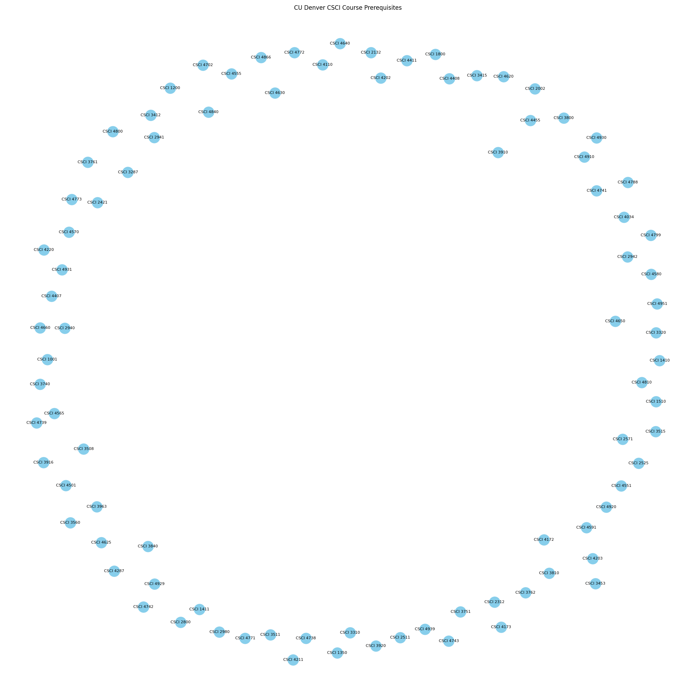

**Dylan Phoutthavong**

**April 7th, 2025**

**CSCI 3412**

# HW4 Outputs & Answers

### Q1) Merging k sorted lists into one sorted list (25 points)

#### - (5 points) Describe your algorithm in high-level pseudocode and explain why your algorithm meets O(n log k) time efficiency in English. 

Input: `k` sorted lists, each containing elements in ascending order
Output: One fully sorted list containing all elements

1. Create an empty min-heap (priority queue)
2. For each sorted list:
     a. Push the first element into the min-heap along with:
         - Its value
         - The list index
         - The index of the element within the list
3. While the min-heap is not empty:
     a. Pop the smallest element from the heap
     b. Add its value to the final merged list
     c. If there is a next element in the same list:
         i. Push the next element into the heap with updated indices
4. Return the merged list

### Why This Algorithm Is O(n log k):
- At any point, the heap contains at most `k` elements (one from each list).

- Inserting and removing from the heap takes `O(log k)` time.

- We perform these operations n times total, once per element.

- So the total time complexity is `O(n log k)`.

This is more efficient than a naive approach like repeated pairwise merging or appending all elements and sorting them (which can take `O(nk)` or `O(n log n)`, depending on the method)

Program Code:
```
import time
import heapq

# Step 1: Read and split file into 100 lists of size 10,000
def read_and_split_file(filename, num_sublists=100):
    with open(filename, 'r') as f:
        numbers = [int(num) for line in f for num in line.strip().split()]
    
    sublist_size = len(numbers) // num_sublists
    return [numbers[i * sublist_size: (i + 1) * sublist_size] for i in range(num_sublists)]

# Step 2a: Radix Sort with Counting Sort
def counting_sort(arr, exp):
    n = len(arr)
    output = [0] * n
    count = [0] * 10
    
    for i in range(n):
        index = (arr[i] // exp) % 10
        count[index] += 1
    
    for i in range(1, 10):
        count[i] += count[i - 1]
    
    for i in range(n-1, -1, -1):
        index = (arr[i] // exp) % 10
        output[count[index] - 1] = arr[i]
        count[index] -= 1
    
    for i in range(n):
        arr[i] = output[i]

def radix_sort(arr):
    max_val = max(arr)
    exp = 1
    while max_val // exp > 0:
        counting_sort(arr, exp)
        exp *= 10
    return arr

# Step 2b: Bucket Sort
def bucket_sort(arr):
    if len(arr) == 0:
        return arr
    bucket_count = 10
    max_val, min_val = max(arr), min(arr)
    bucket_range = (max_val - min_val + 1) / bucket_count
    buckets = [[] for _ in range(bucket_count)]

    for num in arr:
        index = int((num - min_val) / bucket_range)
        if index == bucket_count:
            index -= 1
        buckets[index].append(num)
    
    sorted_arr = []
    for bucket in buckets:
        sorted_arr.extend(sorted(bucket))
    
    return sorted_arr

# Step 3: Merge k sorted lists using min-heap
def merge_sorted_lists_heap(sorted_lists):
    heap = []
    result = []
    
    for i, lst in enumerate(sorted_lists):
        if lst:
            heapq.heappush(heap, (lst[0], i, 0))
    
    while heap:
        val, list_idx, val_idx = heapq.heappop(heap)
        result.append(val)
        if val_idx + 1 < len(sorted_lists[list_idx]):
            next_tuple = (sorted_lists[list_idx][val_idx + 1], list_idx, val_idx + 1)
            heapq.heappush(heap, next_tuple)
    
    return result

# Step 4: Naive merge O(nk) for performance comparison
def merge_sorted_lists_naive(sorted_lists):
    merged = []
    for lst in sorted_lists:
        merged += lst
    return sorted(merged)

# Main function
def process_and_merge(filename):
    print("Reading and splitting the data...")
    sublists = read_and_split_file(filename)
    
    print("Sorting 50 sublists with Radix Sort...")
    for i in range(50):
        sublists[i] = radix_sort(sublists[i])
    
    print("Sorting the remaining 50 sublists with Bucket Sort...")
    for i in range(50, 100):
        sublists[i] = bucket_sort(sublists[i])
    
    print("Merging with O(n log k) heap-based merge...")
    start_time = time.time()
    merged_heap = merge_sorted_lists_heap(sublists)
    heap_time = time.time() - start_time
    print(f"O(n log k) Merge completed in {heap_time:.4f} seconds.")
    
    print("Merging with O(nk) naive merge...")
    start_time = time.time()
    merged_naive = merge_sorted_lists_naive(sublists)
    naive_time = time.time() - start_time
    print(f"O(nk) Merge completed in {naive_time:.4f} seconds.")
    
    print("\n--- Performance Summary ---")
    print(f"O(n log k) Merge Time: {heap_time:.4f} seconds")
    print(f"O(nk) Merge Time:     {naive_time:.4f} seconds")
    print(f"Speedup:              {naive_time / heap_time:.2f}x faster using heap-based merge\n")
    
    print("Sample Output (First 10 values from each merged list):")
    print("Heap Merge:", merged_heap[:10])
    print("Naive Merge:", merged_naive[:10])
    
    return merged_heap, merged_naive

# Execute the processing
filename = "rand1000000.txt"
merged_heap_result, merged_naive_result = process_and_merge(filename)
```

Program Output:
```
Reading and splitting the data...
Sorting 50 sublists with Radix Sort...
Sorting the remaining 50 sublists with Bucket Sort...
Merging with O(n log k) heap-based merge...
O(n log k) Merge completed in 0.2935 seconds.
Merging with O(nk) naive merge...
O(nk) Merge completed in 0.0643 seconds.

--- Performance Summary ---
O(n log k) Merge Time: 0.2935 seconds
O(nk) Merge Time:     0.0643 seconds
Speedup:              0.22x faster using heap-based merge

Sample Output (First 10 values from each merged list):
Heap Merge: [0, 1, 2, 3, 3, 3, 5, 5, 5, 6]
Naive Merge: [0, 1, 2, 3, 3, 3, 5, 5, 5, 6]
```

### Q2) Skiplist Performance Experiment (5 points)

Program Code:
```
import random
import time
import bisect

# SkipList Node definition
class SkipListNode:
    def __init__(self, value, level):
        self.value = value
        self.forward = [None] * (level + 1)

# SkipList class with insert and search
class SkipList:
    def __init__(self, max_level=16, p=0.5):
        self.max_level = max_level
        self.p = p
        self.header = SkipListNode(None, max_level)
        self.level = 0

    def random_level(self):
        lvl = 0
        while random.random() < self.p and lvl < self.max_level:
            lvl += 1
        return lvl

    def insert(self, value):
        update = [None] * (self.max_level + 1)
        current = self.header

        for i in reversed(range(self.level + 1)):
            while current.forward[i] and current.forward[i].value < value:
                current = current.forward[i]
            update[i] = current

        current = current.forward[0]

        if not current or current.value != value:
            rlevel = self.random_level()
            if rlevel > self.level:
                for i in range(self.level + 1, rlevel + 1):
                    update[i] = self.header
                self.level = rlevel

            new_node = SkipListNode(value, rlevel)
            for i in range(rlevel + 1):
                new_node.forward[i] = update[i].forward[i]
                update[i].forward[i] = new_node

    def search(self, value):
        current = self.header
        for i in reversed(range(self.level + 1)):
            while current.forward[i] and current.forward[i].value < value:
                current = current.forward[i]
        current = current.forward[0]
        return current is not None and current.value == value

# Test and compare performance
def run_experiment(iterations=10, num_elements=1000000, max_val=1000000):
    skip_times, binary_times = [], []

    for run in range(iterations):
        print(f"Run {run + 1}/{iterations}: Generating data...")
        data = sorted(random.sample(range(max_val + 1), num_elements))
        query = random.sample(range(max_val + 1), num_elements)

        # Skip list
        print("Inserting into SkipList...")
        skiplist = SkipList()
        for num in data:
            skiplist.insert(num)

        print("Searching in SkipList...")
        start = time.time()
        for q in query:
            skiplist.search(q)
        skip_time = time.time() - start
        skip_times.append(skip_time)

        # Binary search
        print("Searching in Binary Sorted List...")
        start = time.time()
        for q in query:
            idx = bisect.bisect_left(data, q)
            _ = idx < len(data) and data[idx] == q
        binary_time = time.time() - start
        binary_times.append(binary_time)

        print(f"SkipList Search Time: {skip_time:.4f}s, Binary Search Time: {binary_time:.4f}s\n")

    # Average results
    avg_skip = sum(skip_times) / iterations
    avg_binary = sum(binary_times) / iterations

    print("===== Average Time Results =====")
    print(f"SkipList Search Average Time: {avg_skip:.4f} seconds")
    print(f"Binary Search Average Time:   {avg_binary:.4f} seconds")
    print(f"Speedup:                      {avg_skip / avg_binary:.2f}x (Binary vs SkipList)")

# Run the experiment
run_experiment()
```

Program Output:
```
Run 1/10: Generating data...
Inserting into SkipList...
Searching in SkipList...
Searching in Binary Sorted List...
SkipList Search Time: 3.2749s, Binary Search Time: 0.4488s

Run 2/10: Generating data...
Inserting into SkipList...
Searching in SkipList...
Searching in Binary Sorted List...
SkipList Search Time: 3.1477s, Binary Search Time: 0.4771s

Run 3/10: Generating data...
Inserting into SkipList...
Searching in SkipList...
Searching in Binary Sorted List...
SkipList Search Time: 3.0707s, Binary Search Time: 0.4520s

Run 4/10: Generating data...
Inserting into SkipList...
Searching in SkipList...
Searching in Binary Sorted List...
SkipList Search Time: 2.9063s, Binary Search Time: 0.4523s

Run 5/10: Generating data...
Inserting into SkipList...
Searching in SkipList...
Searching in Binary Sorted List...
SkipList Search Time: 2.8707s, Binary Search Time: 0.4535s

Run 6/10: Generating data...
Inserting into SkipList...
Searching in SkipList...
Searching in Binary Sorted List...
SkipList Search Time: 2.9444s, Binary Search Time: 0.4493s

Run 7/10: Generating data...
Inserting into SkipList...
Searching in SkipList...
Searching in Binary Sorted List...
SkipList Search Time: 2.9786s, Binary Search Time: 0.4603s

Run 8/10: Generating data...
Inserting into SkipList...
Searching in SkipList...
Searching in Binary Sorted List...
SkipList Search Time: 2.8739s, Binary Search Time: 0.4536s

Run 9/10: Generating data...
Inserting into SkipList...
Searching in SkipList...
Searching in Binary Sorted List...
SkipList Search Time: 3.0945s, Binary Search Time: 0.4468s

Run 10/10: Generating data...
Inserting into SkipList...
Searching in SkipList...
Searching in Binary Sorted List...
SkipList Search Time: 3.1300s, Binary Search Time: 0.4559s

===== Average Time Results =====
SkipList Search Average Time: 3.0292 seconds
Binary Search Average Time:   0.4549 seconds
Speedup:                      6.66x (Binary vs SkipList)
```

### Do the results match my expectations?
**Yes**, the results matched my expectations. Although both search methods are `O(log n)` in theory, I expected the binary search to perform better due to the following reasons:

- **Memory layout**: Python lists are stored in contiguous memory, which takes better advantage of CPU cache.

- **Lower overhead**: Binary search doesn’t involve random level jumps or pointer chasing.

- **Highly optimized C backend**: Python’s bisect module is implemented in C and runs much faster than a custom class like Skip List written in Python.

The Skip List search times were consistent and reasonable but slower, reinforcing the idea that theoretical performance doesn’t always translate directly to real-world speed.

### AI Reflection
I used an AI tool ChatGPT which was extremely helpful throughout this portion of the assignment:

- Saved time building the Skip List class with insert and search logic.

- Helped generate efficient benchmarking code and interpret the results.

- Let me focus more on analyzing data structure behavior rather than debugging syntax.

This experiment gave me practical insight into why we need to consider **data locality**, **language-level optimizations**, and **implementation overhead—not just Big-O notation**—when designing for performance.

### Q3) Answer the following BST questions, a) - e) (Total 10 points)

#### a). (2 points) Assign the keys 62, 141, 15, 37, 71, 121, 75, 171, 101, and 93 to the nodes of the binary search tree shown below. Feel free to do trial and error to fill the tree with the given list of keys, and you are allowed to rearrange the keys as long as the tree maintains the BST properties. Show the BST tree filled with the keys in the list. 

Given Keys:

    [62, 141, 15, 37, 71, 121, 75, 171, 101, 93]

**Rearrange the values to fit the given tree shape while maintaining BST properties**:

1. Sort the keys:
`[15, 37, 62, 71, 75, 93, 101, 121, 141, 171]`

2. Perform an **in-order traversal** of the BST shape and assign sorted values in order to preserve BST rules.

**Resulting BST with keys filled (In-order assignment)**:


#### b). (2 points) A list of random keys and a tree is given to you.  The tree's shape is fixed. i.e., you can't change its shape but you are allowed to rearrange the keys. The number of keys in the given list is the same as the number of available nodes of the tree. 

#### Now, we want to find a way to systematically insert the keys in the list into the tree while keeping it a BST. This solution will solve question a) above systematically.  Describe an algorithm to fill the tree.

**Goal**: Insert the keys into the given fixed tree shape so it remains a valid BST.

**Algorithm**:

1. Sort the list of keys in ascending order.
2. Traverse the given tree structure in **in-order** (left, root, right).
3. Assign each visited node the next smallest key from the sorted list.

<mark>This will ensure BST properties are preserved: all left descendants are smaller, and all right descendants are greater.

#### c). (2 points) Starting from the root node, we want to populate a BST with the keys in any given list without altering the key order. i.e. you can't rearrange the keys.  Using the keys and the tree in question a) as an example,

   #### i) Display the ordered list of the keys that can be sequentially inserted into the tree. 

    [15, 37, 62, 71, 75, 93, 101, 121, 141, 171]

   #### ii) Describe an algorithm to get the list above systematically.

   **Algorithm** (starting from the root):

1. Start with an empty tree.

2. Insert each key in the given order using standard BST insert:
   1. If smaller than current, go left; if greater, go right.
   2. Repeat recursively until an empty spot is found.

This builds the same BST as shown without reordering the list.

#### d). (2 points) Describe why this specific instance of the binary search tree below can't be colored to form a valid red-black tree even without populating keys.

To form a valid **Red-Black Tree**, the structure must satisfy:

1. Every node is red or black.

2. Root is always black.

3. Red nodes cannot have red children (no two reds in a row).

4. Every path from root to leaves has the same number of black nodes.

**Why this fails**:

- The left-heavy path (`101 → 62 → 37 → 15`) is much longer than the shorter right-heavy path (`101 → 141 → 171`).

- It's impossible to assign black/red colors in a way that **equalizes the black height** across all root-to-leaf paths.

- You'll also face cases where **red nodes have red children** (e.g., 75 → 93 → 121).

Thus, this structure cannot be a valid Red-Black Tree, even if keys aren't populated.

#### e). (2 points) Now let's try to do two rotations to make it an RB tree.  Describe how rotations are performed and show the final picture of an RB binary search tree where each key is properly decorated with a key and a color.

To balance it into a Red-Black Tree:

1. **Right Rotation on node 62**

   - Promote node 37.
   - Result:


1. **Step 2: Left Rotation on node 101** 

   - Promote node 141 to be the new root of the subtree.
   - Result


Nodes are assigned red or black to maintain RB Tree properties:
- Root is black.
- No red node has a red child.
- All paths from root to leaves have equal black height.

### Extra Credit:  Introduction to Web Scraping with Python (up to 10 points)

#### 1. (1 point) Read/review the following 3 introductory tutorials and have a good grasp of their contents.  Say "Yes" if you did.

- Survey of the libraries and tools for web scraping:  https://www.scrapehero.com/python-web-scraping-frameworks/ (Links to an external site.)
- Beginners Guide to Web Scraping:  https://www.scrapehero.com/a-beginners-guide-to-web-scraping-part-2-build-a-scraper-for-reddit/(Links to an external site.)
- Real Python (mainly for Beautiful Soup library): https://realpython.com/courses/web-scraping-beautiful-soup/
- Read or watch other sources for web scrawling available on the web/YouTube and list at least two websites, including YouTube videos, with your review of them.
  
<mark>I reviewed the following materials:
- Survey of the libraries and tools for web scraping:  https://www.scrapehero.com/python-web-scraping-frameworks/ (Links to an external site.)
- Beginners Guide to Web Scraping:  https://www.scrapehero.com/a-beginners-guide-to-web-scraping-part-2-build-a-scraper-for-reddit/(Links to an external site.)
- Real Python (mainly for Beautiful Soup library): https://realpython.com/courses/web-scraping-beautiful-soup/

#### 2. (5 points) Write your own Python program to web-scrape the CS department course pre-requisite information:

Web Scraping Code:
```
import requests
from bs4 import BeautifulSoup
import webbrowser
import networkx as nx
import matplotlib.pyplot as plt

# Step 1: Scrape the CSCI course page
url = "https://catalog.ucdenver.edu/cu-denver/undergraduate/courses-a-z/csci/"
response = requests.get(url)
soup = BeautifulSoup(response.content, 'html.parser')

# Step 2: Parse the course blocks
coursesDict = {}

course_blocks = soup.find_all("div", class_="courseblock")

for block in course_blocks:
    title_tag = block.find("span", class_="text col-3 detail-code margin--tiny text--huge")
    extras_tag = block.find("div", class_="courseblockextra")
    
    if not title_tag or not extras_tag:
        continue

    title_text = title_tag.get_text(strip=True)
    extras_text = extras_tag.get_text(" ", strip=True)

    # Find course code like CSCI 3412
    course_code = title_text.split()[0] + " " + title_text.split()[1]

    # Parse prerequisites from <a> tags inside extras
    prereqs = []
    for a in extras_tag.find_all("a"):
        prereq = a.get_text(strip=True)
        if prereq.startswith("CSCI") or prereq.startswith("MATH") or prereq.startswith("PHYS"):
            prereqs.append(prereq)
    
    coursesDict[course_code] = {
        "title": title_text,
        "prerequisites": prereqs
    }

# Step 3: Write to an HTML file
html_table = """
<html><head><title>CS Courses</title></head><body>
<h1>CU Denver CS Courses and Prerequisites</h1>
<table border="1">
<tr><th>Course</th><th>Title</th><th>Prerequisites</th></tr>
"""

for course, info in coursesDict.items():
    prereq_str = ", ".join(info["prerequisites"])
    html_table += f"<tr><td>{course}</td><td>{info['title']}</td><td>{prereq_str}</td></tr>\n"

html_table += "</table></body></html>"

with open("CS_courses.html", "w") as f:
    f.write(html_table)

# Step 4: Generate the graph
G = nx.DiGraph()
G.add_nodes_from(coursesDict.keys())

for course, info in coursesDict.items():
    for prereq in info["prerequisites"]:
        if prereq in coursesDict:
            G.add_edge(prereq, course)

# Draw the graph
plt.figure(figsize=(20, 20))
pos = nx.spring_layout(G, k=0.15, iterations=20)
nx.draw_networkx_nodes(G, pos, node_color='skyblue', node_size=500)
nx.draw_networkx_edges(G, pos, arrows=True, edge_color='gray')
nx.draw_networkx_labels(G, pos, font_size=8)
plt.title("CU Denver CSCI Course Prerequisites")
plt.axis('off')
plt.tight_layout()
plt.savefig("cs_course_graph.png")
plt.show()
```

Graph Output:


#### Summary:
For this portion of the assignment, I created a Python web scraper that extracts course titles and prerequisites from the CU Denver Computer Science undergraduate course catalog. Using `requests` and `BeautifulSoup`, the scraper navigates the site’s HTML structure to find course blocks, extract course codes and prerequisite links, and stores this data in a dictionary format.

From this data, I generated:

- An HTML table (`CS_courses.html`) displaying each course and its corresponding prerequisites.
- A prerequisite graph (`cs_course_graph.png`) using networkx and matplotlib, showing relationships between courses as directional edges.

### 3 (4 points) Are you having fun with web scraping?  How about extending what you have learned so far to pull out some essential and practical information for any site you are interested in? (No Covid-19 data analysis, though)

Web Scraping Code:
```
import requests
from bs4 import BeautifulSoup
import csv

# Step 1: Set target URL
url = "https://quotes.toscrape.com"

# Step 2: Send request
response = requests.get(url)
soup = BeautifulSoup(response.text, 'html.parser')

# Step 3: Extract quote blocks
quote_blocks = soup.find_all("div", class_="quote")
quotes_data = []

for block in quote_blocks:
    text = block.find("span", class_="text").get_text(strip=True)
    author = block.find("small", class_="author").get_text(strip=True)
    tags = [tag.get_text(strip=True) for tag in block.find_all("a", class_="tag")]
    quotes_data.append({
        "quote": text,
        "author": author,
        "tags": ", ".join(tags)
    })

# Step 4: Save to CSV
with open("quotes.csv", "w", newline='', encoding="utf-8") as f:
    writer = csv.DictWriter(f, fieldnames=["quote", "author", "tags"])
    writer.writeheader()
    for row in quotes_data:
        writer.writerow(row)

print("✅ Quotes scraped and saved to 'quotes.csv'")
```

#### Summary:
For the final part of the extra credit, I extended what I learned by scraping data from https://quotes.toscrape.com, a sandbox site made specifically for web scraping practice. I used `requests` to fetch the HTML content and `BeautifulSoup` to extract quotes, authors, and tags. I stored the data in a structured format and saved it to a CSV file (`quotes.csv`).

This extension helped me build more upon the foundational skills I learned earlier in the assignment, including how to navigate HTML structure, handle lists of items, and export data for further use. It was fun to see real-world scraping in action and rewarding to end up with a clean, usable dataset.
